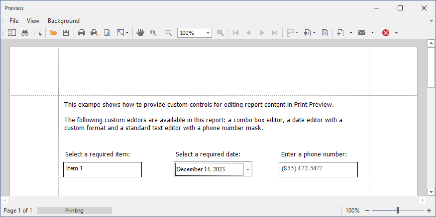

<!-- default badges list -->

<!-- default badges end -->

# Reporting for WinForms - How to use custom controls for editing report content in Print Preview

This example demonstrates how to create and register custom editors to be used for [editing the content of report controls in Print Preview](https://docs.devexpress.com/XtraReports/117343/detailed-guide-to-devexpress-reporting/provide-interactivity/edit-content-in-print-preview). In particular, it shows how to create a combo box editor, a date editor with a custom format, and a standard text editor with a phone number mask.
  
The following image illustrates the resulted custom controls in Print Preview: 
  
  
  
To implement a custom editor, create a new instance of an appropriate [RepositoryItem](https://docs.devexpress.com/WindowsForms/DevExpress.XtraEditors.Repository.RepositoryItem) descendant and specify its settings. Then, call the [EditingFieldExtensionsWin.RegisterEditor](https://docs.devexpress.com/WindowsForms/DevExpress.XtraPrinting.Preview.EditingFieldExtensionsWin.RegisterEditor(System.String-System.String-System.String-DevExpress.XtraEditors.Repository.RepositoryItem)) method to register this editor. Enable editing of a control's content by setting the [EditOptions.Enabled](https://docs.devexpress.com/XtraReports/DevExpress.XtraReports.UI.EditOptions.Enabled) property to `true` and assign the created editor to the [EditorName](https://docs.devexpress.com/XtraReports/DevExpress.XtraReports.UI.TextEditOptions.EditorName) property. 
  
To register the standard text editor with a custom mask, use the [EditingFieldExtensionsWin.RegisterMaskEditor](https://docs.devexpress.com/WindowsForms/DevExpress.XtraPrinting.Preview.EditingFieldExtensionsWin.RegisterMaskEditor(System.String-System.String-System.String-DevExpress.XtraEditors.Mask.MaskType-System.String)) method.

## Files to Review

* [Form1.cs](./CS/RegisterCustomFieldEditor/Form1.cs) (VB: [Form1.vb](./VB/RegisterCustomFieldEditor/Form1.vb))

## Documentation

* [Use Custom Controls](https://docs.devexpress.com/XtraReports/2607/detailed-guide-to-devexpress-reporting/use-report-controls/use-custom-controls)

## More Examples

- [Reporting for WinForms - Create a Custom Progress Bar Control](https://github.com/DevExpress-Examples/reporting-winforms-custom-progress-bar-control)
- [Reporting for Web Forms - How to use custom controls for editing report content in Print Preview](https://github.com/DevExpress-Examples/reporting-web-forms-custom-controls-for-editing-report-content-in-print-preview/)
